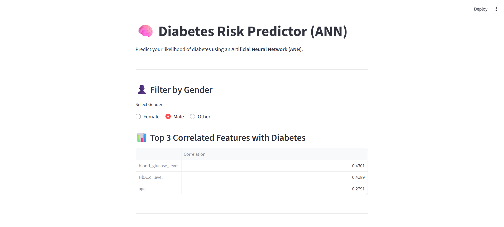
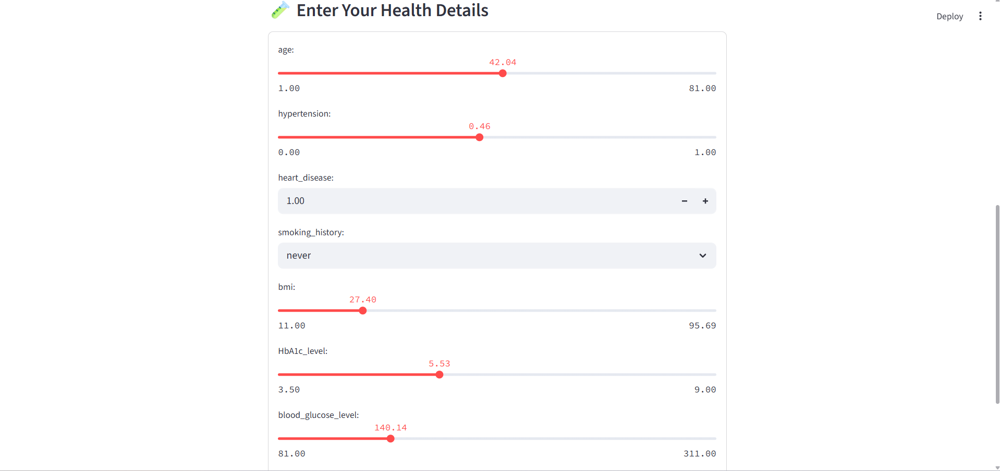
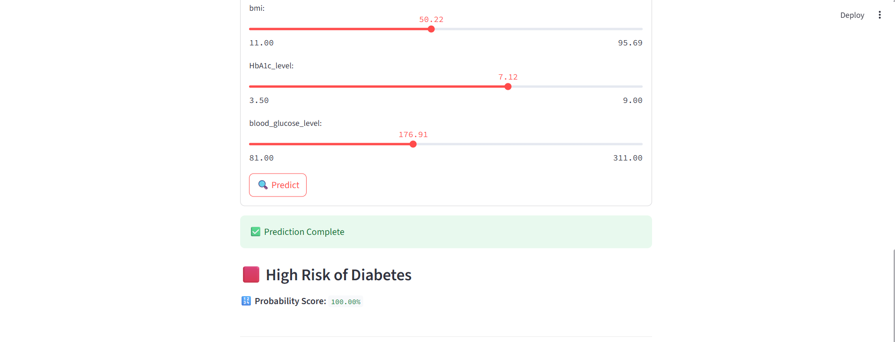

# 🧠 Diabetes Risk Predictor (ANN)

> 🚀 This project predicts diabetes risk using an Artificial Neural Network (ANN) trained on health and lifestyle data.  
> Developed with Python and deployed via Streamlit for real-time predictions.

---

## 🚀 Features

- 💻 Built with **Python**, **ANN**, and **Streamlit**
- 📊 Uses health-related features (glucose, age, BMI, etc.)
- 🔍 Real-time risk prediction
- 🧪 Pre-trained model included
- 📈 Displays top feature correlations

---

## 📷 Screenshots

### 🖼️ Page 1


### 🖼️ Page 2


### 🖼️ Page 3


---

## 🗂️ Files in the Repository

| File                      | Description                                      |
|---------------------------|--------------------------------------------------|
| `Diabetes_Jupter.ANN.ipynb` | Notebook with model training                   |
| `train_model.py`          | Python script to train the model                |
| `diabetes_model.pkl`      | Trained ANN model                               |
| `scaler.pkl`              | Data standardizer                               |
| `label_encoders.pkl`      | Encoded categorical variables                   |
| `diabetes_prediction_dataset.csv` | Dataset used                             |
| `Diabetes.Stremlit.py`    | Streamlit frontend script                       |

---

## ⚙️ How to Run the App Locally

```bash
# Clone the repo
git clone https://github.com/YourUsername/Diabetes-Risk-Prediction-Ann

# Navigate into the directory
cd Diabetes-Risk-Prediction-Ann

# Install dependencies
pip install -r requirements.txt

# Run the app
streamlit run Diabetes.Stremlit.py

